# Google Sheets: conectar el POS a una planilla

Una planilla de Google Sheets puede ser el backend del POS, sin servidor y sin costo: los productos y
los clientes se cargan en la planilla, y las ventas, las cobranzas y los movimientos de caja llegan
solos. Hace falta una cuenta de Google y el código de esta página,
[`pos-sheets.gs`](pos-sheets.gs) (el botón **Copiar el código**, arriba).

## Qué vas a hacer

1. [Instalar el puente en la planilla](#1-instalar-el-puente-en-la-planilla): pegar el código y
   publicarlo como aplicación web. Una sola vez.
2. [Preparar la planilla](#2-preparar-la-planilla): completar un formulario. Una sola vez.
3. [Conectar cada caja](#3-conectar-cada-caja): abrir un link en cada terminal.
4. [Actualizar el puente](#actualizar-el-puente), cuando haya una versión nueva.
5. [Volver a empezar](#volver-a-empezar): borrar todo, por ejemplo después de probar.
6. [Proteger la planilla con un secreto](#opcional-proteger-la-planilla-con-un-secreto)
   (opcional).

Las imágenes de las pantallas de Google son esquemáticas: Google cambia detalles de su interfaz, pero
los nombres de los menús y de los botones son estos.

## 1. Instalar el puente en la planilla

**1.1** Creá una planilla vacía en Google Sheets y abrí **Extensiones > Apps Script**.

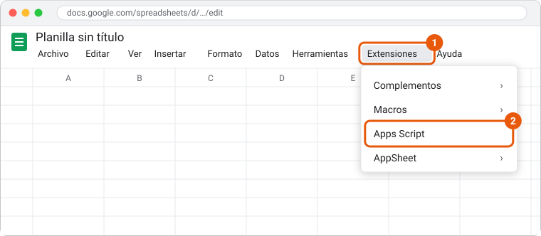

**1.2** En el editor, borrá todo lo que tiene `Código.gs`, pegá el código (**Copiar el código**,
arriba de esta página) y guardá con el ícono del disquete o Ctrl+S.

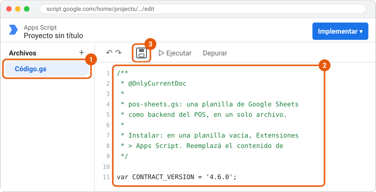

**1.3** Arriba a la derecha, **Implementar > Nueva implementación**.

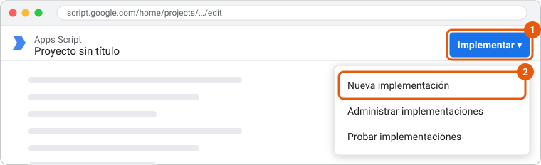

**1.4** En el engranaje de "Seleccionar tipo", elegí **Aplicación web**, completá así y tocá
**Implementar**:

- Ejecutar como: **Yo**
- Quién tiene acceso: **Cualquier persona**

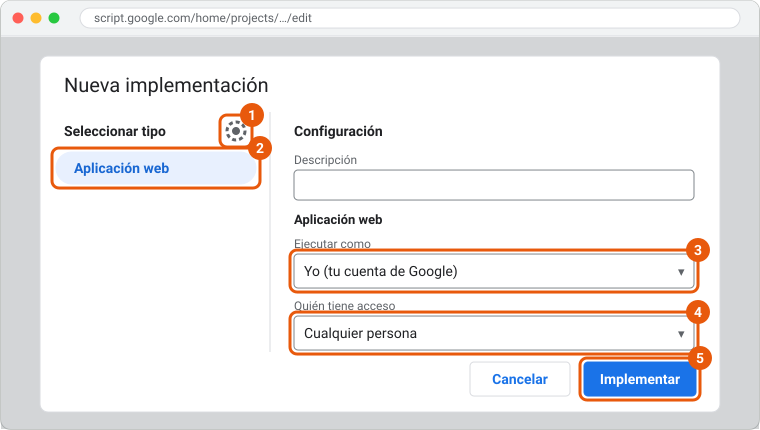

**1.5** Google pide autorizar el acceso: **Autorizar acceso** y elegí tu cuenta. El aviso "Google no
verificó esta app" es normal en un código propio: **Configuración avanzada > Ir a … (no seguro)**.
Al final, Google tiene que pedir acceso **solo a esta planilla**; si pide acceso a **todas** tus
hojas de cálculo, cancelá: el código no es el de esta página.

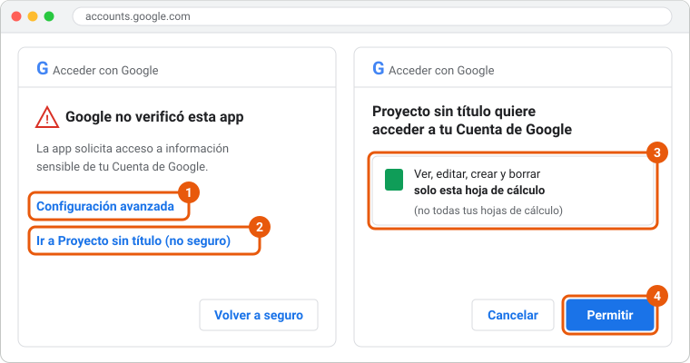

**1.6** Copiá la **URL de la aplicación web** (termina en `/exec`) y abrila en el navegador: es la
página de tu planilla. Guardala, porque la vas a abrir desde cada caja.

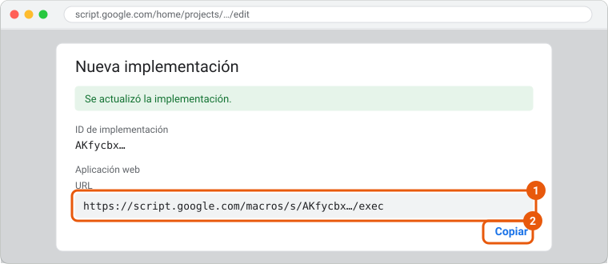

"Cualquier persona" no deja que nadie edite tu planilla: el POS escribe a través del código, con tus
permisos, y la página nunca borra nada sin que lo permitas.

## 2. Preparar la planilla

**2.1** En la página de la planilla, completá el **nombre del comercio**, la **sucursal** y la
**caja**, y elegí con qué empezar:

- **Ferretería**, **Kiosco** o **Almacén**: con productos, clientes y diez días de ventas de
  ejemplo, para probar con algo parecido a un comercio de verdad.
- **Vacía**: sin datos, para cargar tus productos y tus clientes.

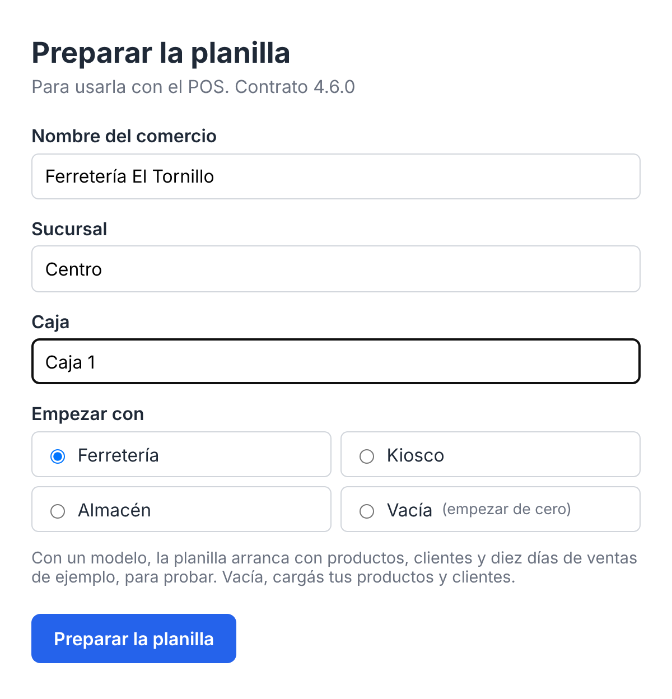

**2.2** Tocá **Preparar la planilla**. En unos segundos la planilla tiene sus pestañas, empezando
por el **Tablero** (las ventas del día, de la semana, los medios de pago, lo más vendido y el fiado),
y la página ofrece **Abrir la planilla** y **Abrir el POS**.

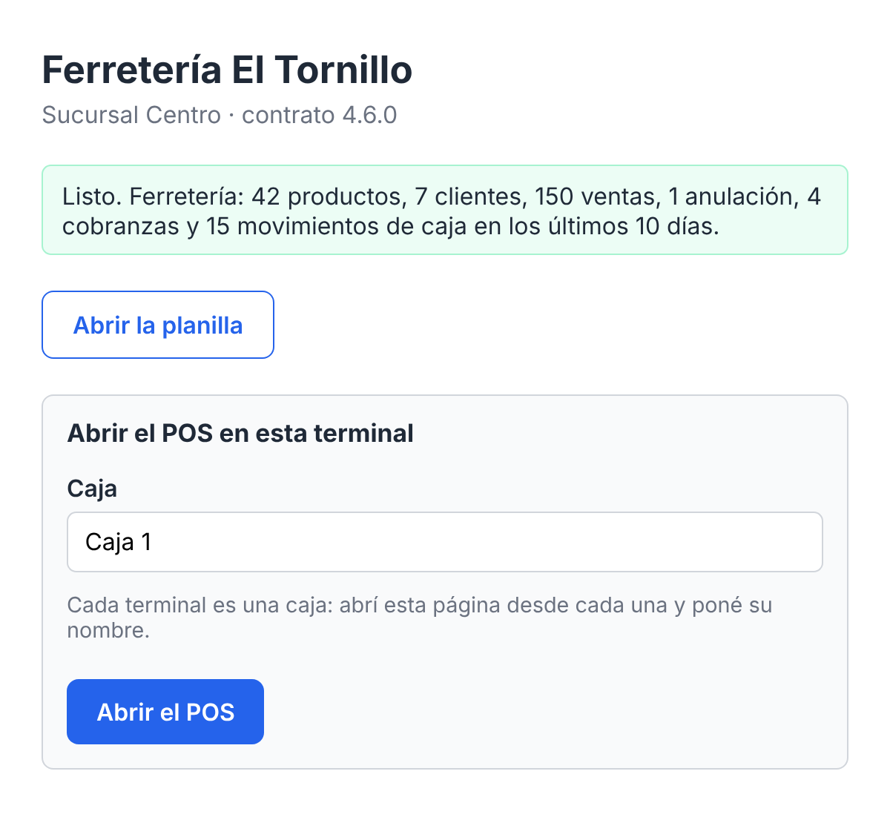

Tus productos y tus clientes se cargan en las pestañas **Productos** y **Clientes**, cuando quieras:
el POS los trae solo.

## 3. Conectar cada caja

**3.1** En la terminal, abrí la página de la planilla (la URL del paso 1.6; también está en el
Tablero, en **Abrir el POS en una caja**).

**3.2** Poné el nombre de **esta** caja (por ejemplo, "Caja 2") y tocá **Abrir el POS**.

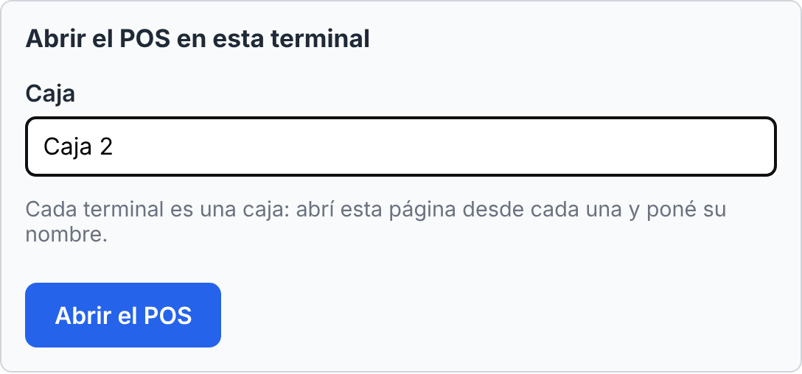

**3.3** El POS se abre conectado a la planilla, con la sucursal y la caja cargadas, listo para
vender.

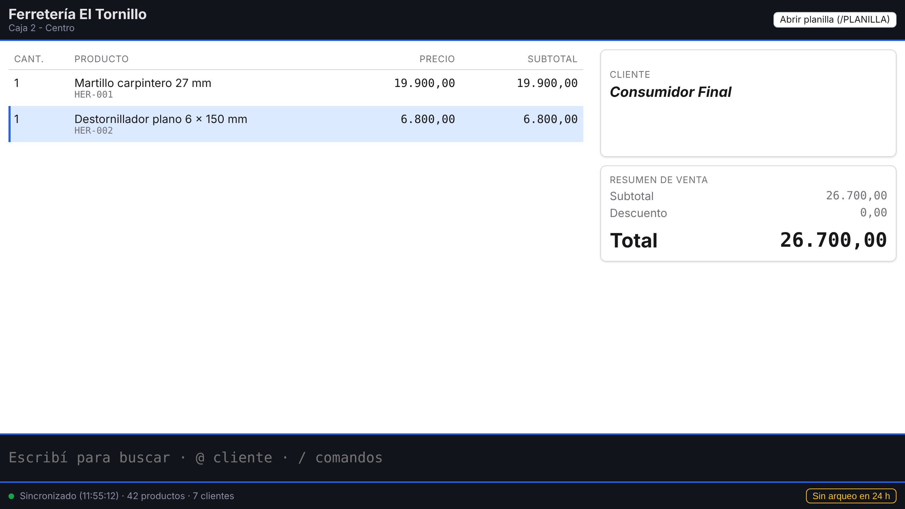

Si la terminal ya tenía datos de otra conexión, o la planilla tiene un secreto, el POS abre su
configuración con todo precargado: elegí qué hacer con los datos (o cargá el secreto) y seguí.

Repetí estos pasos en cada caja, cada una con su nombre.

## Actualizar el puente

**1.** Copiá el código nuevo con **Copiar el código**, en esta página.

**2.** En la planilla, **Extensiones > Apps Script**: reemplazá todo el contenido de `Código.gs` y
guardá. Si el proyecto tiene `bridge.gs` y `columnas.gs` (de una versión anterior), borralos.

**3.** **Implementar > Administrar implementaciones**, el lápiz, Versión: **Nueva versión** y
**Implementar**.

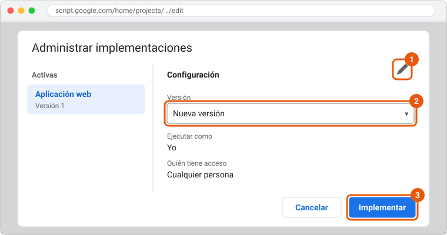

La URL no cambia y las cajas siguen conectadas, sin tocar nada. No uses **Nueva implementación**:
da otra URL, y cada caja tendría que conectarse de nuevo.

## Volver a empezar

Reiniciar borra **todas** las pestañas de la planilla (también las que agregaste vos) y vuelve al
formulario del paso 2.

**1.** En la pestaña **Configuración** de la planilla, poné **Sí** en "Permitir reiniciar".

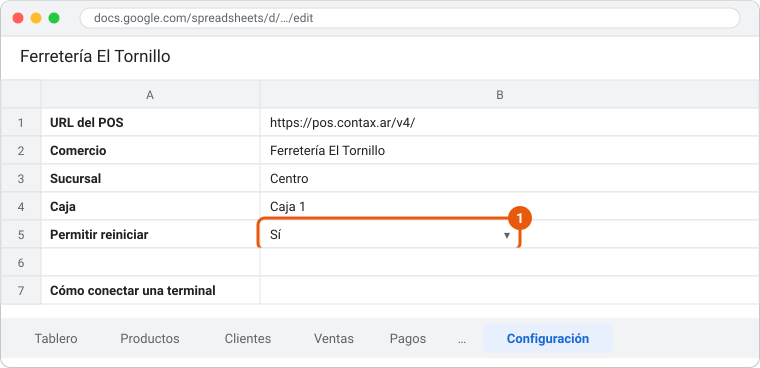

**2.** Recargá la página de la planilla y tocá **Reiniciar la planilla**.

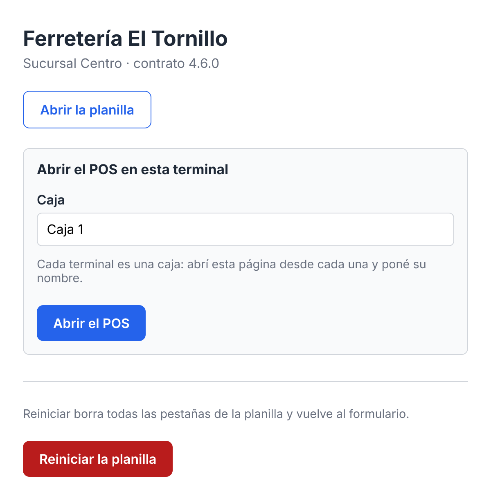

**3.** En cada caja que estaba conectada, volvé a abrir el POS desde la página y elegí borrar sus
datos.

## (Opcional) Proteger la planilla con un secreto

Sin secreto, quien tenga la URL de la aplicación web puede mandarle ventas a la planilla. Para que
solo tus cajas puedan:

**1.** En Apps Script, **Configuración del proyecto** (el engranaje) > **Propiedades de la secuencia
de comandos** > **Agregar propiedad de secuencia de comandos**: `SHARED_SECRET` y el valor que
quieras. Guardá.

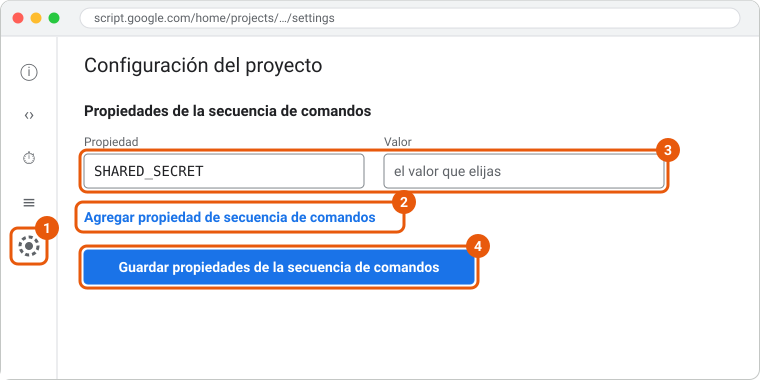

**2.** En cada caja, abrí el POS desde la página de la planilla como en el paso 3: la configuración
se abre con todo cargado menos el secreto. Cargalo en **Secreto compartido** y seguí. En una caja
ya conectada, lo mismo desde `/CONFIG`.

El link de la página nunca lleva el secreto: se carga a mano en cada caja.

## Para saber más

La [referencia del puente](referencia.html) tiene el resto: qué hace y qué no, los
permisos, el Tablero, la pestaña Configuración, el portal, cómo se edita la planilla, qué guarda cada
venta, el contrato del puente y sus limitaciones.
